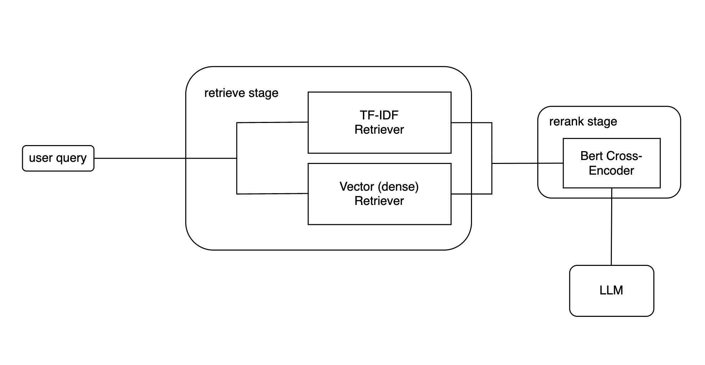

## Описание
Базовый RAG-пайплайн, адаптированный под домен русскоязычных текстов. 

Общая структура RAG:



## Конфигурация
Все параметры конфигурации находятся в .env файле. В данной конфигурации
был использован bi-encoder `sentence-transformers/paraphrase-multilingual-mpnet-base-v2`, выбранный опираясь на [лидерборд encodechka](https://github.com/avidale/encodechka). 

В качестве cross-encoder использован `DiTy/cross-encoder-russian-msmarco`, обученный на [MS-MARCO Russian passage ranking dataset](https://huggingface.co/datasets/unicamp-dl/mmarco).

Локальная LLM - `Saiga/Llama3 8B`, инференс через `llama.cpp` в квантизации `q4_K`.
Векторное хранилище - FAISS, с автоматическим сохранением/кешированием индекса после его вычисления. Для принудительного пересчета индекса стоит установить параметр `RECOMPUTE_ON_APP_RELOAD=True` в `.env`.

Конфигурация протестирована на MBP M1 на 10% датасета [Lenta.Ru-News-Dataset](https://github.com/yutkin/Lenta.Ru-News-Dataset). В файле `preprocess_lentaru_csv.py` содержится небольшой препроцессинг csv файла датасета.

## Установка
1. Установка Python зависимостей
   ```sh
   python3 -m venv venv
   source venv/bin/activate
   pip install -r requirements.txt
   ```
2. Загрузка `Saiga/Llama3 8B q4_K`
   ```sh
   wget https://huggingface.co/IlyaGusev/saiga_llama3_8b_gguf/resolve/main/model-q4_K.gguf
   ```
3. Запуск приложения
   ```sh
   python main.py
   ```
